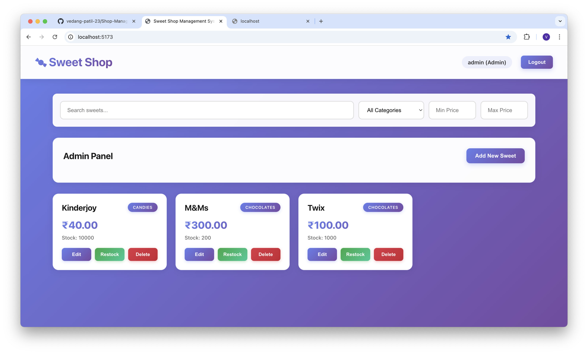

# Sweet Shop Management System (SSMS)

A full-stack web application for managing a sweet shop inventory with user authentication, CRUD operations, and purchase management.

## Project Overview

The Sweet Shop Management System is built using Node.js/Express with TypeScript for the backend and React with TypeScript for the frontend. It features JWT-based authentication, role-based access control (admin/user), and a complete inventory management system.

## Features

- **User Authentication**: Register and login with JWT token-based authentication
- **Role-Based Access**: Admin and regular user roles with different permissions
- **Sweets Management**: Full CRUD operations for managing sweets inventory
- **Category System**: 10 predefined categories (Chocolates, Candies, Gummies, Lollipops, Toffees, Jellies, Hard Candies, Sour Candies, Caramels, Mints)
- **Search & Filter**: Search by name, filter by category, and filter by price range
- **Purchase System**: Users can purchase sweets (decreases inventory)
- **Admin Features**: Admin can add, edit, delete, and restock sweets
- **Responsive Design**: Modern, responsive UI with gradient styling

## Screenshots



*Dashboard view showing the admin panel, sweets inventory, and search/filter functionality*

## Tech Stack

### Backend
- Node.js with Express
- TypeScript
- SQLite (persistent database)
- JWT for authentication
- bcryptjs for password hashing

### Frontend
- React 18
- TypeScript
- Vite
- React Router
- Axios

## Prerequisites

- Node.js (v16 or higher)
- npm or yarn

## Setup Instructions

### Backend Setup

1. Navigate to the backend directory:
```bash
cd backend
```

2. Install dependencies:
```bash
npm install
```

3. Create a `.env` file in the backend directory (optional):
```env
JWT_SECRET=your-super-secret-jwt-key-change-in-production
PORT=3001
```

4. Start the development server:
```bash
npm run dev
```

The backend server will run on `http://localhost:3001`

### Frontend Setup

1. Navigate to the frontend directory:
```bash
cd frontend
```

2. Install dependencies:
```bash
npm install
```

3. Start the development server:
```bash
npm run dev
```

The frontend will run on `http://localhost:5173` (or another port if 5173 is in use)

4. Open your browser and navigate to the URL shown in the terminal (typically `http://localhost:5173`)

## Default Admin Credentials

- **Email**: `admin@sweetshop.com`
- **Password**: `admin123`

You can also register a new user account through the registration page.

## API Endpoints

### Authentication
- `POST /api/auth/register` - Register a new user
- `POST /api/auth/login` - Login and get JWT token

### Sweets (Protected - Requires Authentication)
- `GET /api/sweets` - Get all sweets
- `GET /api/sweets/search` - Search sweets (query params: name, category, minPrice, maxPrice)
- `POST /api/sweets` - Create a new sweet (Admin only)
- `PUT /api/sweets/:id` - Update a sweet (Admin only)
- `DELETE /api/sweets/:id` - Delete a sweet (Admin only)

### Inventory (Protected)
- `POST /api/sweets/:id/purchase` - Purchase a sweet (decreases quantity)
- `POST /api/sweets/:id/restock` - Restock a sweet (Admin only, increases quantity)

## Project Structure

```
SSMS/
├── backend/
│   ├── src/
│   │   ├── database.ts          # Database setup and queries
│   │   ├── index.ts             # Express server entry point
│   │   ├── middleware/
│   │   │   └── auth.ts          # Authentication middleware
│   │   └── routes/
│   │       ├── auth.ts          # Authentication routes
│   │       └── sweets.ts        # Sweets management routes
│   ├── package.json
│   └── tsconfig.json
├── frontend/
│   ├── src/
│   │   ├── components/         # React components
│   │   ├── pages/              # Page components
│   │   ├── context/            # React context (Auth)
│   │   ├── constants/          # Constants (categories)
│   │   ├── api.ts              # API service
│   │   └── App.tsx             # Main app component
│   ├── package.json
│   └── vite.config.ts
└── README.md
```

## Usage

1. Start both backend and frontend servers
2. Open the frontend URL in your browser
3. Register a new account or login with admin credentials
4. Browse sweets, use search/filter, and make purchases
5. As admin, use the Admin Panel to manage sweets inventory

## My AI Usage

### AI Tools Used
- **Cursor AI (Claude/ChatGPT)**: Primary AI assistant used throughout development

### How AI Was Used

1. **Project Structure Setup**: AI helped design the initial project architecture, suggesting the separation of backend/frontend and folder structure.

2. **Code Generation**: 
   - Generated boilerplate code for Express routes, React components, and TypeScript configurations
   - Created authentication middleware and JWT implementation
   - Assisted with database schema design

3. **Debugging & Problem Solving**:
   - Helped resolve port conflicts and server startup issues
   - Fixed layout and styling problems in the admin panel
   - Assisted with TypeScript type definitions

4. **Feature Implementation**:
   - Implemented category dropdown functionality
   - Refined UI/UX for admin panel layout
   - Optimized form validation and error handling

5. **Code Review**: AI reviewed code for best practices, suggesting improvements for authentication flow and component structure.

### Reflection on AI Impact

Using AI significantly accelerated the development process, especially for:
- Setting up the initial project structure
- Generating boilerplate code for routes and components
- Debugging configuration issues (ports, database paths)
- Implementing features like the category system

However, I ensured I understood every piece of code generated. I manually reviewed and adjusted all AI-generated code to match project requirements, fixed bugs independently, and made architectural decisions about the overall structure.

The AI was used as a powerful pair-programming tool, but the final implementation, logic flow, and understanding of the codebase remain my own work.

## License

This project is part of a project submission.

